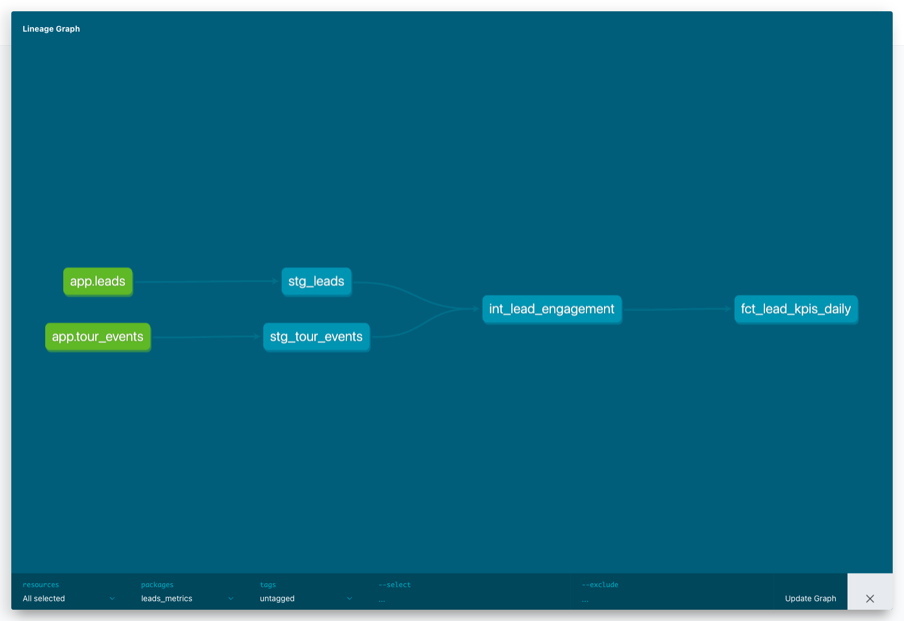

Leads Metrics (dbt + Supabase)

This project models recruiter funnel KPIs using dbt on top of a Supabase Postgres database. It demonstrates a full analytics engineering workflow including source modeling, layered transformations, business logic definition, and data validation.

The goal is to transform raw operational data into a reliable, well-documented KPI layer for reporting and decision-making.

## Documentation Preview

These screenshots are generated automatically from the local dbt docs build and focus on the documented analytics layer.

Overview

This project builds a daily KPI table that tracks:

Lead creation volume
Candidate conversion (resume submission)
Recruiter engagement within 7 days
Rejection outcomes

It also reconciles multiple sources of truth:

behavioral event data (tour_events)
application state transitions (leads.status)
Data Sources
public.leads

Primary entity representing a lead in the recruiting pipeline.

Key fields:

id
created_at
updated_at
status
resume_submitted_at
tour_id
public.tour_events

Event stream capturing user interactions.

Key fields:

tour_id
event_type
first_seen_at
Modeling Approach

The project follows a standard dbt layered architecture:

1. Staging (stg_)

Light transformations and normalization of raw sources.

stg_leads
stg_tour_events

Responsibilities:

rename columns
standardize timestamps
ensure clean primary keys
2. Intermediate (int_)

Business logic and metric definitions at the lead level.

int_lead_engagement

This layer defines:

Candidate conversion
resume_submitted_flag
Recruiter engagement (within 7 days)

Two independent signals:

event-based: activity in tour_events
status-based: progression to tour_began or interview_scheduled

These are combined into:

engaged_within_7d_flag
Outcome
rejected_flag
3. Marts (fct_)

Aggregated KPI tables for reporting.

fct_lead_kpis_daily

Metrics include:

leads_created
resumes_submitted
rejected_leads
event_engaged_within_7d_leads
status_engaged_within_7d_leads
engaged_within_7d_leads
corresponding rates
KPI Definitions
Leads Created

Number of leads created per day.

Resume Submitted

Candidate-side conversion event.

Rejected

Final recruiter disposition. Modeled separately from engagement.

Engagement (within 7 days)

A lead is considered engaged if either:

an event occurs within 7 days of lead creation, or
the lead progresses to tour_began or interview_scheduled within 7 days

This combines behavioral tracking and workflow progression to reduce undercounting.

Data Validation

Several validation steps are included:

1. Row count reconciliation

Ensures no data loss across layers:

stg_leads row count matches
sum of leads_created in the mart
2. Custom dbt test

test_lead_count_matches.sql verifies:

stg_leads == sum(fct_lead_kpis_daily.leads_created)
3. Logic validation

Additional checks performed:

engagement flags align with timestamps
rates fall between 0 and 1
no duplicate lead records in intermediate models
4. Cross-source reconciliation

Compares:

event-based engagement vs status-based engagement

This highlights gaps between tracking systems.

Key Design Decisions
Separation of concerns
staging = raw cleanup
intermediate = business logic
marts = reporting
Engagement vs conversion vs outcome
engagement = recruiter-side activity
conversion = candidate action
rejection = outcome

These are modeled independently to avoid conflating concepts.

Dual-source engagement logic

Using both event data and status transitions improves robustness when instrumentation is incomplete.

Use of updated_at

Used as a proxy for status timing. This is a practical approximation; a full status history table would provide more precision.

How to Run
1. Install dependencies
pip install dbt-postgres
2. Configure profile

Set up ~/.dbt/profiles.yml with your Supabase credentials.

3. Run models
dbt run
4. Run tests
dbt test
5. Generate docs
dbt docs generate
dbt docs serve
Project Structure
models/
  staging/
  intermediate/
  marts/

tests/
analyses/
Future Improvements
add source freshness tests
introduce status history tracking for more precise timing
expand funnel modeling (offer, hire, etc.)
build a lightweight dashboard on top of fct_lead_kpis_daily
parameterize engagement window (7 days → configurable)
Why This Project

This project demonstrates:

dbt project setup and configuration
modeling structured pipelines from raw data to KPIs
handling imperfect data sources
defining business metrics clearly and defensibly
validating transformations with tests and reconciliation

It reflects real-world analytics engineering challenges where multiple systems and imperfect signals must be combined into a trusted reporting layer.